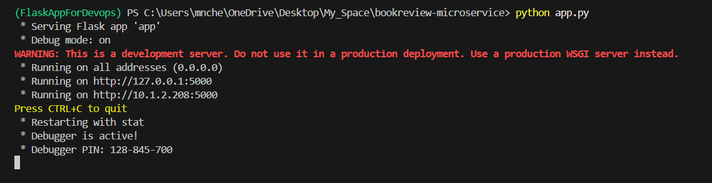
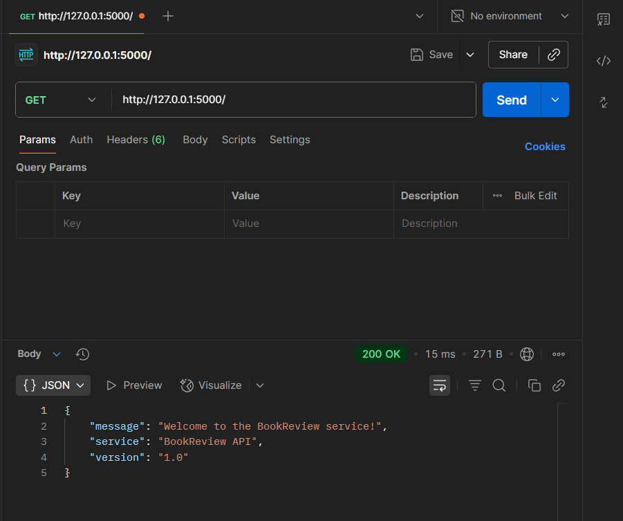
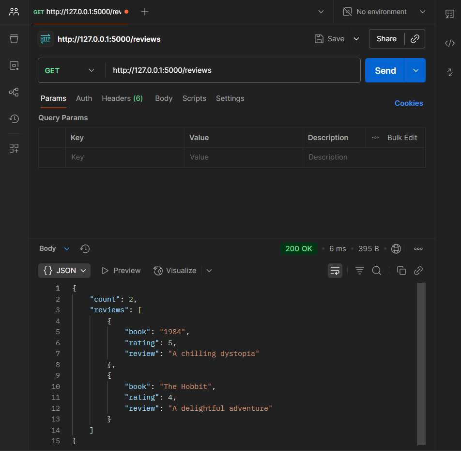
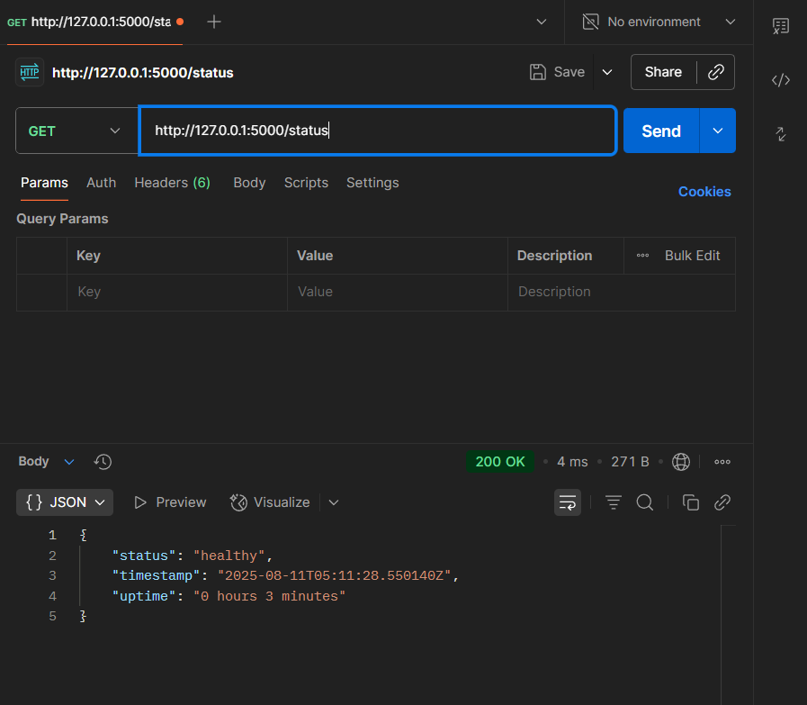

# 📚 BookReview Microservice

[](https://github.com/7Chethan007/bookreview-microservice)
[](https://flask.palletsprojects.com/)
[](https://www.python.org/)
[](https://www.postman.com/)

## 1. Project Introduction
The **BookReview Microservice** is a lightweight Flask-based REST API that manages book reviews and ratings for an online bookstore.  
It is designed as a **real-world-like microservice** to demonstrate DevOps skills, including CI/CD pipelines, Dockerization, Jenkins automation, and AWS deployment.

---

## 2. Architecture Diagram


**Workflow:**
1. Developer pushes code to GitHub.
2. GitHub Actions runs linting and automated tests.
3. Jenkins pulls the latest code, builds a Docker image, and pushes it to Docker Hub.
4. AWS EC2 pulls and runs the container.
5. API becomes available over the public internet.

---

## 3. Tech Stack
- **Backend Framework:** Flask (Python)
- **Language:** Python 3.11
- **Package Manager:** pip
- **Testing:** pytest
- **Containerization:** Docker
- **CI:** GitHub Actions
- **CD:** Jenkins
- **Cloud:** AWS EC2
- **Version Control:** Git & GitHub

---

## 4. API Endpoints

### **`GET /`**
**Purpose:** Welcome route to confirm API is running.  
**Response:**
```json
{
  "service": "BookReview API",
  "version": "1.0",
  "message": "Welcome to the BookReview service!"
}
```

### **`GET /reviews`**
**Purpose:** Get all book reviews.  
**Response:**
```json
{
  "reviews": [
    {"book": "1984", "review": "A chilling dystopia", "rating": 5},
    {"book": "The Hobbit", "review": "A delightful adventure", "rating": 4}
  ],
  "count": 2
}
```

### **`GET /status`**
**Purpose:** Health check endpoint.  
**Response:**
```json
{
  "status": "healthy",
  "uptime": "2 hours 15 minutes",
  "timestamp": "2025-08-11T12:45:00Z"
}
```

---

## 5. Local Development Setup

### **Prerequisites**
- Python 3.8+ installed
- Git installed
- Virtual environment tool (venv)

### **Step 1: Clone the Repository**
```bash
git clone https://github.com/7Chethan007/bookreview-microservice.git
cd bookreview-microservice
```

### **Step 2: Set Up Virtual Environment**
```bash
# Create virtual environment
python -m venv FlaskAppForDevops

# Activate virtual environment
# Windows PowerShell:
FlaskAppForDevops\Scripts\Activate.ps1

# Windows CMD:
FlaskAppForDevops\Scripts\activate.bat

# Linux/Mac:
source FlaskAppForDevops/bin/activate
```

### **Step 3: Install Dependencies**
```bash
pip install -r requirements.txt
```

### **Step 4: Run the Application**
```bash
# Set environment variables (Windows PowerShell)
$env:FLASK_APP = "app.py"
$env:FLASK_ENV = "development"

# Set environment variables (Windows CMD)
set FLASK_APP=app.py
set FLASK_ENV=development

# Run the Flask application
python app.py
```

The API will be available at `http://127.0.0.1:5000`

---

## 6. Testing the API ✅

### **Using Postman (Completed)**
✅ **Collection Created:** "BookReview API"  
✅ **All Endpoints Tested:** Welcome, Reviews, Status  
✅ **Screenshots Captured:** Available in `docs/screenshots/`

**Collection Setup:**
1. ✅ Created new collection called "BookReview API"
2. ✅ Added the following requests:

**Request 1: Welcome Endpoint** ✅
- Method: `GET`
- URL: `http://127.0.0.1:5000/`
- Status: **TESTED SUCCESSFULLY**

**Request 2: Get Reviews** ✅
- Method: `GET`
- URL: `http://127.0.0.1:5000/reviews`
- Status: **TESTED SUCCESSFULLY**

**Request 3: Health Check** ✅
- Method: `GET`
- URL: `http://127.0.0.1:5000/status`
- Status: **TESTED SUCCESSFULLY**

### **Using curl**
```bash
# Test welcome endpoint
curl http://127.0.0.1:5000/

# Test reviews endpoint
curl http://127.0.0.1:5000/reviews

# Test health check
curl http://127.0.0.1:5000/status
```

---

## 7. Running Tests

### **Install pytest (if not already installed)**
```bash
pip install pytest
```

### **Run Tests**
```bash
# Run all tests
pytest -v

# Run with coverage
pytest --cov=app -v
```

**Expected Output:**
```
tests/test_app.py::test_root PASSED
tests/test_app.py::test_reviews PASSED
tests/test_app.py::test_status PASSED
```

---

## 8. Project Structure
```
bookreview-microservice/
├── app.py                 # Main Flask application
├── requirements.txt       # Python dependencies
├── README.md              # Project documentation
├── .gitignore             # Git ignore file
├── tests/                 # Automated tests
│   └── test_app.py
└── docs/
    ├── architecture-diagram.png
    └── screenshots/
        ├── local-run.png
        ├── ci-pipeline.png
        ├── jenkins-output.png
        └── ec2-output.png
```

---

## 9. DevOps Pipeline (Future Implementation)

### **Phase 1: Containerization**
- Create `Dockerfile`
- Create `docker-compose.yml`
- Build and test Docker image locally

### **Phase 2: CI/CD Setup**
- Configure GitHub Actions for CI
- Set up Jenkins for CD
- Implement automated testing and deployment

### **Phase 3: Cloud Deployment**
- Deploy to AWS EC2
- Configure security groups and networking
- Set up monitoring and logging

---

## 10. Screenshots

### **Local Development**

*Flask application running successfully on localhost:5000*

### **Postman API Testing**

**Welcome Endpoint Response:**

*GET / endpoint returning welcome message*

**Reviews Endpoint Response:**

*GET /reviews endpoint returning book reviews data*

**Status/Health Check Response:**

*GET /status endpoint returning health status and uptime*

### **Testing Results Summary**
✅ All endpoints tested successfully with Postman  
✅ Flask application runs without errors  
✅ JSON responses match expected format  
✅ Health check endpoint shows proper uptime tracking

---

## 11. Contributing
1. Fork the repository
2. Create a feature branch (`git checkout -b feature/new-feature`)
3. Commit your changes (`git commit -am 'Add new feature'`)
4. Push to the branch (`git push origin feature/new-feature`)
5. Create a Pull Request

---

## 12. License
This project is licensed under the MIT License - see the LICENSE file for details.
